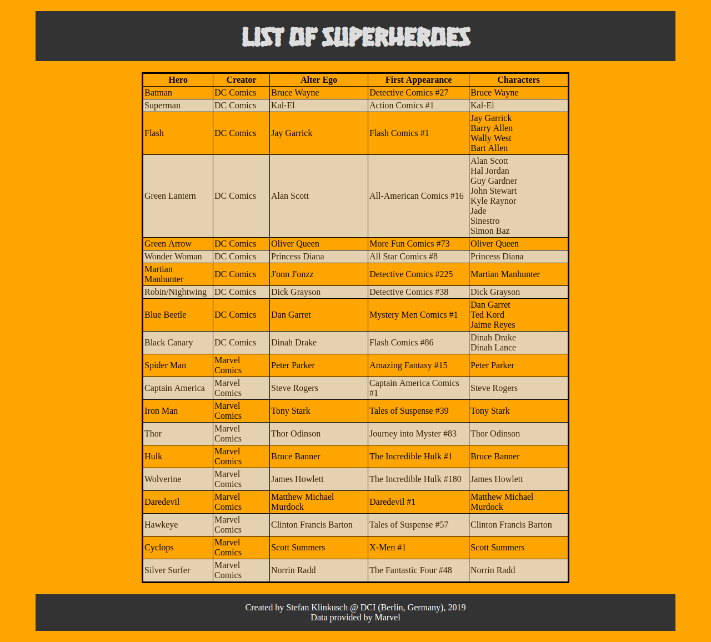

# JSON-more-heroes

This webpage was created by Stefan Klinkusch at Digital Career Institute in Berlin, Germany using HTML, CSS, and vanilla JavaScript. It consumes the data about superheroes from [a private API](https://gist.githubusercontent.com/LeandroDCI/697427913933937f714dc9c4e728d1c7/raw/ce065f1a72d937eade74e5523d68d834ec2b5304/Heroes.json) and prints it as a table on the webpage.

## Features

It features
- a  ```fetch``` of the data with error handling
- output as a table

## Screenshot

